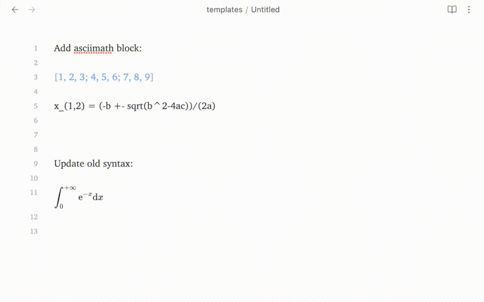

# Obsidian Asciimath

## Install

- (Recommended) Goto Obsidian plugin market, search for `obsidian-asciimath` and install it.
- (Manually) Goto the [release page](https://github.com/widcardw/obsidian-asciimath/releases), download the zip, unzip it and add it to your plugins folder.

## Usage

You can write math formulas with the syntax of [asciimath](http://asciimath.org).
I've recently refactored the library, and you can refer to [asciimath-parser](https://github.com/widcardw/asciimath-parser) and [its online demo](https://asciimath.widcard.win).

> [!WARNING]
> Some of the rules are not exactly consistent with http://asciimath.org, especially the matrix. For more information, please refer to https://asciimath.widcard.win.


### ⚠️ Migrating from notes created with plugin version 0.6.3 or lower. ⚠️
If you never used AsciiMath before, you can skip this section.
<details>
<summary>Click to see instructions</summary>

In previous versions of the plugin users had to use this special syntax for inline math. This feature is deprecated and will be removed in the future.
> Note: default code blocks with three backticks will be supported as usual.

New syntax integrates with default Obsidian [math blocks](https://help.obsidian.md/Editing+and+formatting/Advanced+formatting+syntax#Math) (dollar-sign blocks), which fully compatible when using both LaTeX and AsciiMath.

From now on, you should create inline blocks like this:
```diff
++ $<my_ascii_math>$
instead of
-- `$ <my_ascii_math> $`
```

To prepare your notes for the newer version of the plugin, you must convert your old AsciiMath notes to new syntax. This can be easily done with plugin commands:
- Hit `Ctrl + P` to open up command pallet.
- Search for "Update old AsciiMath". Choose one of the two available commands by the "obsidian-asciimath" plugin.
- Confirm the changes.
- You're good to go!
</details>


#### Code block

~~~text
```am (or asciimath)
sum _(n=1) ^oo 1/n^2 = pi^2/6
```
~~~


Multiline formula alignment (Specially thanks to [asciimath-js](https://github.com/zmx0142857/asciimathml))

~~~text
```am
f: RR & -> S^1
                         <-- a blank line here
x & |-> "e"^(2pi "i" x)
```
~~~


> asciimath is simple and easy to read, while in LaTeX, you should write the long formula with so many backslashes, and sometimes may be confusing...
>
> ```tex
> \begin{aligned}
> f: \mathbb{R} & \to S^{1} \\
> x & \mapsto \mathrm{e}^{2 \pi \mathrm{i} x }
> \end{aligned}
> ```

#### Using dollar-sign math blocks.
Default obsidian math is wrapped in `$` on both ends for the inline math and with `$$` for the display-style block.
You can enable "Replace math block" option in the plugin settings which allows the plugin to render AsciiMath inside of dollar-sign blocks.
> The neat part is that you can keep your LaTeX math blocks as they are, because the plugin is smart enough to guess which syntax is used for a particular block.


## Commands

- Insert asciimath codeblock.
- Convert asciimath into mathjax in current file.
- Convert asciimath into mathjax in the entire vault.
- Update asciimath blocks to new syntax in current file (Compatibilty with old version).
- Update asciimath blocks to new syntax in the entire vault (Compatibilty with old version).



## Development

```sh
git clone git@github.com:widcardw/obsidian-asciimath.git
pnpm i
pnpm run dev
```

## Support

During my use, this plugin often causes Obsidian rendering problems (especially in live preview mode). If you are interested in helping me to improve it, please feel free to give suggestions on github [issues](https://github.com/widcardw/obsidian-asciimath/issues) or [pull requests](https://github.com/widcardw/obsidian-asciimath/pulls). Thank you!
